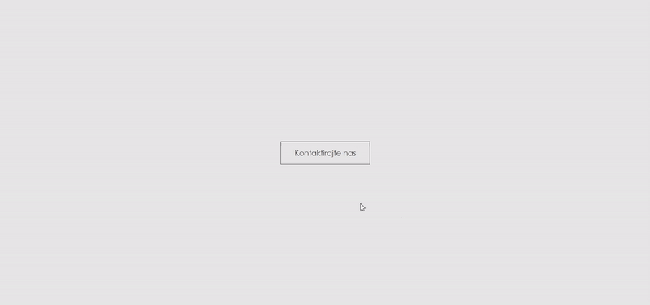

<h1 align="center">Contact Form</h1>
<h3 align="center">Minimalistic contact form that pops-up when button is clicked</h3>

<h3 align="center">✔️ Finished</h3>

## Tech and tools used

## Show your support
Give a ⭐️ if this project helped you!
